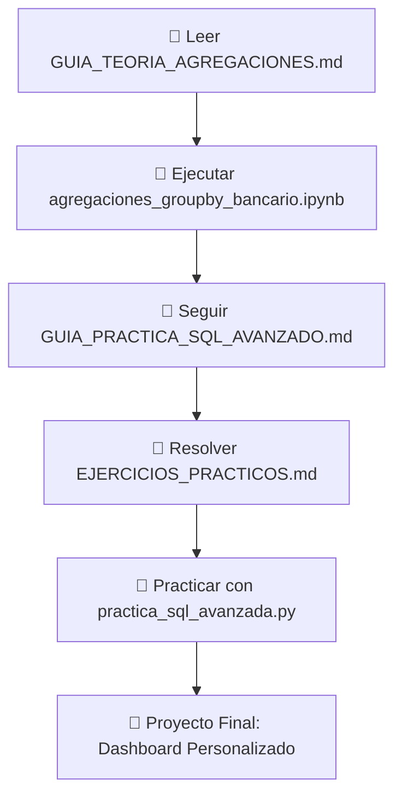

# 📊 Módulo 2: Agregaciones y GROUP BY en Banking Analytics

## 🎯 **Descripción**
Este módulo te enseña a dominar las **agregaciones SQL** aplicadas al análisis bancario. Aprenderás a transformar datos individuales en insights estratégicos usando GROUP BY, funciones de agregación y filtros avanzados.

---

## 📚 **Contenido del Módulo**

### **🏆 Objetivos de Aprendizaje**
- 🧮 **Funciones de Agregación**: COUNT, SUM, AVG, MAX, MIN
- 📈 **GROUP BY**: Agrupaciones simples y múltiples
- 🔍 **HAVING**: Filtros en grupos agregados
- 💼 **KPIs Bancarios**: Métricas fundamentales de negocio
- 📊 **Análisis de Concentración**: Distribución de cartera
- 📅 **Análisis Temporal**: Tendencias y patrones

### **📁 Archivos Incluidos**

| Archivo | Tipo | Descripción |
|---------|------|-------------|
| `agregaciones_groupby_bancario.ipynb` | 📓 **Notebook** | Tutorial interactivo completo con ejemplos prácticos |
| `GUIA_TEORIA_AGREGACIONES.md` | 📖 **Teoría** | Guía teórica detallada con mejores prácticas |
| `GUIA_PRACTICA_SQL_AVANZADO.md` | 🎯 **Práctica** | Ejercicios paso a paso con validaciones |
| `EJERCICIOS_PRACTICOS.md` | 💪 **Ejercicios** | Retos progresivos desde básico hasta avanzado |
| `practica_sql_avanzada.py` | 🐍 **Script** | Código Python para práctica programática |
| `README.md` | 📋 **Guía** | Este archivo de navegación |

---

## 🚀 **Cómo Usar Este Módulo**

### **📋 Prerrequisitos**
- ✅ Completar el **Módulo 1**: Fundamentos SQL
- 🐍 Python 3.8+ con pandas, sqlite3, matplotlib
- 📊 Acceso a `banking_core.db` en el directorio `/data/`
- 💻 Jupyter Notebook o VS Code con extensión Python

### **🗺️ Ruta de Aprendizaje Recomendada**



### **⏰ Tiempo Estimado**
- 📖 **Teoría**: 2-3 horas
- 📓 **Notebook**: 3-4 horas  
- 💪 **Ejercicios**: 4-6 horas
- 🎯 **Proyecto**: 2-3 horas
- **🕐 Total**: 11-16 horas

---

## 💼 **Aplicaciones Bancarias**

### **🔢 KPIs que Aprenderás a Calcular**

| KPI | Descripción | Fórmula SQL Básica |
|-----|-------------|-------------------|
| **Concentración de Cartera** | % de saldo por producto | `SUM(saldo) / total_saldos * 100` |
| **Penetración de Productos** | % clientes con producto | `clientes_producto / total_clientes * 100` |
| **Saldo Promedio por Segmento** | Valor medio por grupo | `AVG(saldo_actual) GROUP BY segmento` |
| **Distribución de Saldos** | Rangos de concentración | `CASE WHEN saldo BETWEEN x AND y` |
| **Análisis Pareto** | Top clientes (80/20) | `ORDER BY saldo DESC LIMIT` |
| **Tendencias Temporales** | Crecimiento mensual | `GROUP BY EXTRACT(MONTH)` |

### **🎯 Casos de Uso Reales**
- 📊 **Dashboard Ejecutivo**: Métricas clave para la dirección
- 🎯 **Segmentación de Clientes**: Marketing dirigido por comportamiento
- 📈 **Análisis de Rentabilidad**: Productos más exitosos
- ⚠️ **Alertas de Concentración**: Gestión de riesgo
- 📅 **Reportes Periódicos**: Tendencias y estacionalidad

---

## 🛠️ **Configuración Técnica**

### **🔧 Setup del Entorno**
```bash
# 1. Navegar al directorio del proyecto
cd sql-banking-analytics/notebooks/02_agregaciones_groupby

# 2. Activar entorno virtual (si no está activo)
source ../../venv_banking_sql/bin/activate

# 3. Verificar instalación de dependencias
pip install -r ../../requirements.txt

# 4. Verificar base de datos
ls -la ../../data/banking_core.db
```

### **🐍 Ejecutar Notebook**
```bash
# Opción 1: Jupyter Notebook
jupyter notebook agregaciones_groupby_bancario.ipynb

# Opción 2: VS Code (recomendado)
code agregaciones_groupby_bancario.ipynb
```

### **🧪 Ejecutar Scripts de Práctica**
```bash
# Ejecutar script de práctica
python practica_sql_avanzada.py

# Ver estructura de datos
sqlite3 ../../data/banking_core.db ".schema"
```

---

## 📈 **Progresión de Conceptos**

### **🔰 Nivel Básico**
1. **Funciones de Agregación Simples**
   - COUNT(), SUM(), AVG(), MAX(), MIN()
   - Aplicaciones bancarias directas
   - Manejo de valores NULL

2. **GROUP BY Básico**
   - Agrupación por una columna
   - Análisis por segmento de clientes
   - Métricas por producto

### **📊 Nivel Intermedio**
3. **GROUP BY Múltiple**
   - Agrupación por varias columnas
   - Análisis multidimensional
   - Tablas de contingencia

4. **HAVING vs WHERE**
   - Diferencias conceptuales
   - Filtros pre y post agrupación
   - Casos de uso específicos

### **🚀 Nivel Avanzado**
5. **KPIs Complejos**
   - Cálculos de concentración
   - Análisis de distribución
   - Métricas de penetración

6. **Análisis Temporal**
   - Agrupación por períodos
   - Tendencias y estacionalidad
   - Cohortes básicos

---

## 💡 **Ejemplos Destacados**

### **🔢 Concentración de Cartera**
```sql
SELECT 
    pf.categoria,
    SUM(c.saldo_actual) as saldo_total,
    ROUND(SUM(c.saldo_actual) * 100.0 / 
          (SELECT SUM(saldo_actual) FROM cuentas), 2) as porcentaje_cartera
FROM productos_financieros pf
JOIN cuentas c ON pf.producto_id = c.producto_id
WHERE c.estado = 'ACTIVA'
GROUP BY pf.categoria
ORDER BY saldo_total DESC;
```

### **👥 Segmentación Dinámica**
```sql
SELECT 
    CASE 
        WHEN ingresos_mensuales <= 2000000 THEN 'Básico'
        WHEN ingresos_mensuales <= 5000000 THEN 'Premium'
        ELSE 'VIP'
    END as segmento,
    COUNT(*) as cantidad_clientes,
    AVG(ingresos_mensuales) as ingreso_promedio
FROM clientes
WHERE estado = 'ACTIVO'
GROUP BY segmento
ORDER BY ingreso_promedio DESC;
```

---

## 🎯 **Evaluación y Certificación**

### **✅ Criterios de Dominio**
- [ ] Ejecutar todas las celdas del notebook sin errores
- [ ] Resolver al menos 80% de ejercicios básicos e intermedios
- [ ] Completar un ejercicio avanzado exitosamente
- [ ] Crear un KPI personalizado con justificación de negocio
- [ ] Explicar la diferencia entre WHERE y HAVING con ejemplos

### **🏆 Proyecto Final Sugerido**
**"Dashboard de Métricas Bancarias"**
- Crear 5 KPIs diferentes usando agregaciones
- Incluir análisis temporal (últimos 12 meses)
- Generar alertas automáticas (HAVING)
- Documentar hallazgos de negocio
- Presentar recomendaciones estratégicas

---

## 🔗 **Conexiones con Otros Módulos**

### **⬅️ Prerrequisitos**
- **Módulo 1**: Fundamentos SQL necesarios para filtros y selecciones básicas

### **➡️ Preparación para**
- **Módulo 3**: JOINs complejos con agregaciones
- **Módulo 4**: KPIs bancarios avanzados
- **Módulo 5**: Análisis de cartera de crédito

### **🔄 Sinergias**
- Las agregaciones son fundamentales para JOINs complejos
- Base para todos los análisis cuantitativos posteriores
- Prerequisito para window functions y análisis avanzados

---

## 📞 **Soporte y Recursos**

### **📚 Documentación Adicional**
- [SQLite Aggregate Functions](https://sqlite.org/lang_aggfunc.html)
- [SQL GROUP BY Best Practices](https://mode.com/sql-tutorial/sql-group-by/)
- [Banking KPIs Reference](https://www.investopedia.com/terms/k/kpi.asp)

### **💬 Comunidad y Ayuda**
- Revisa `EJERCICIOS_PRACTICOS.md` para hints y soluciones
- Consulta ejemplos específicos en el notebook interactivo
- Usa casos de debugging incluidos para troubleshooting

### **🔄 Actualizaciones**
- **Última actualización**: Enero 2024
- **Versión del módulo**: 2.0
- **Compatibilidad**: SQLite 3.x, Python 3.8+

---

## 🎉 **¡Éxito en tu Aprendizaje!**

**Este módulo es crucial para tu desarrollo como analista bancario. Las agregaciones son la base de prácticamente todos los reportes y análisis cuantitativos en el sector financiero.**

**💪 ¡Tómate tu tiempo, practica los conceptos, y no dudes en experimentar con consultas propias!**

---

### **🏃‍♂️ Siguiente Paso**
Una vez completado este módulo, continúa con:
**📁 `/notebooks/03_joins_relaciones/`** - JOINs y Relaciones Avanzadas
